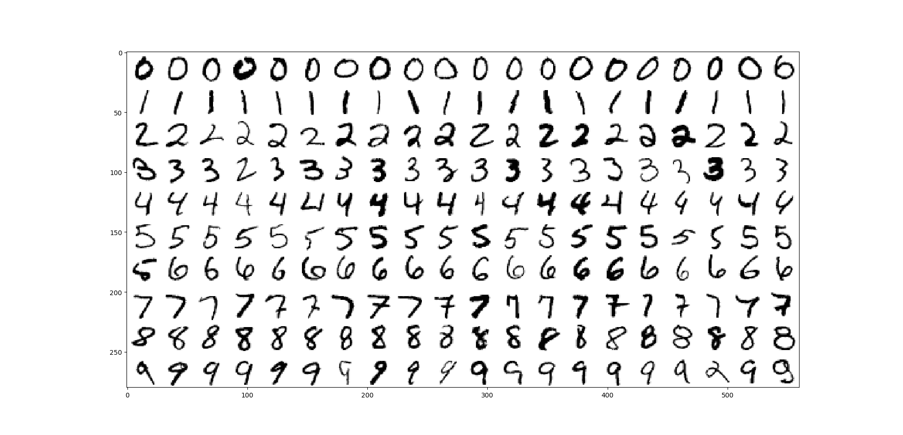

# MNIST handwriting classifier
Logistic regression neural network classifier for MNIST handwriting data

## Sample results
With
* Network (single hidden layer): 784 nodes -> 100 nodes -> 10 nodes
* Training data: 60,000 labelled samples (with 10 training epochs)
* Bias: 1
* Learning rate: 0.01
* Node activation function: sigmoid logistic (1 / (1 + e-x))

Accuracy over training data: 98.04%  
Accuracy over test data: 96.56%

Network confusion matrix:
<pre>[[5883    1   31   18    5   14   37   12   29   16]
 [   2 6704   20   12   17    8   11   15   43   10]
 [   2   10 5820   41    9    7   11   34    9    2]
 [   1    2   25 5922    1   23    0    6   23   16]
 [   4    7    7    5 5713    1    5    6    7   14]
 [   2    1    5   39    2 5314   17    4   25    9]
 [   6    0    7    3   12   16 5811    0    7    0]
 [   2    7   12   20   15    1    1 6127    4   21]
 [  19    5   24   34    7   20   23   13 5680   14]
 [   2    5    7   37   61   17    2   48   24 5847]]</pre>
 
 Sample classified output:
 
 
